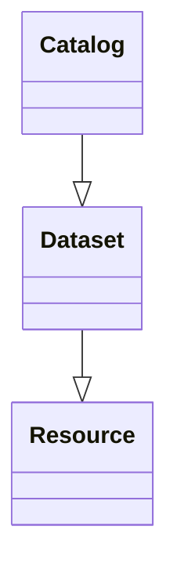
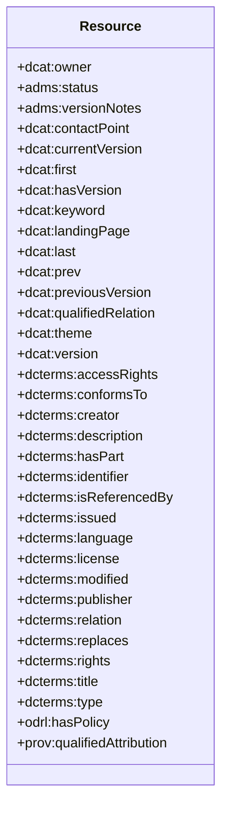
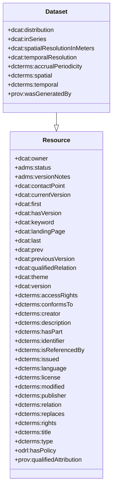
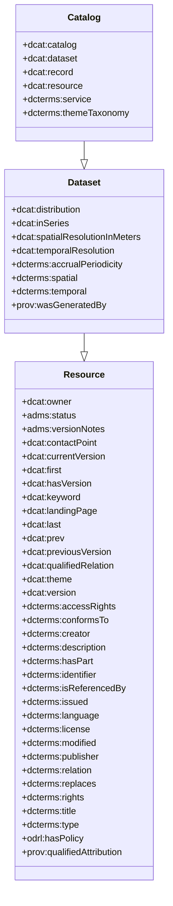

Introduction to DCAT
--------------------

*Note*: This section in only to provide a general overview of the DCAT Vocabulary. For a more in-depth explanation, please refer to the DCAT Vocabulary specification.

The DCAT Vocabulary is an RDF Vocabulary that works with dataset catalogues. Each specified class and properties are general and data-agnostic, allowing a large flexibility in implementation. Moreover, the vocabulary is intended to be extended for finer contexts, which can be a good target for the EPND project and any other health catalogues and records.

Features include:

* Oriented around catalogs and associated resources
  * Associate datasets, resources, and others into a common collection of
metadata.

* General and agnostic class/properties – Can be used in any
dataset context
* Catalog grouping
  * Create catalogs for catalogs if necessary
* Intended to be extended for finer contexts
  * Example: StatDCAT-AP
    * <https://github.com/SEMICeu/StatDCAT-AP>

* Full specification (version 3):
  * <https://www.w3.org/TR/vocab-dcat-3/#vocabulary-overview>

Class Overview
--------------

While the DCAT Vocabulary diagram shows 8 interconnected classes, the vocabulary is centered around 3:

* dcat:Resource
* dcat:Dataset
* dcat:Catalog

Each of the previous implement properties from one another in the following way:

<figure id="mermaid-dcat-hierarchy">

<figcaption>Main DCAT Hierarchy</figcaption>
</figure>

### dcat:Resource

Definition - “Resource published or curated by a single agent”

<figure id="mermaid-dcat-resource">

<figcaption>DCAT Resource class</figcaption>
</figure>

* Basic fields for a published
resource
  * Not intended to be used
directly

* All instances should belong
to a dcat:Catalog instance

### dcat:Dataset

Definition - “A collection of data,
published or curated by a single
agent, and available for access or
download in one or more
representations.”

<figure id="mermaid-dcat-dataset">

<figcaption>DCAT Dataset class</figcaption>
</figure>

* Sub-class of *dcat:Resource*
* Vague and data-agnostic, can be used in any dataset context;

### dcat:Catalog

Definition – “A curated collection
of metadata about resources”

<figure id="mermaid-dcat-catalog">

<figcaption>DCAT Catalog class</figcaption>
</figure>

* Sub-class of dcat:Dataset
* Collects instances of:
  * dcat:Dataset
  * dcat:DataService
  * dcat:Resource
  * dcat:CatalogRecord
  * Additional dcat:Catalog
instances

* Unique fields and extended
dcat:Dataset/dcat:Resource
fields can all be used to
specify metadata
* dcat:themeTaxonomy used
to further define the catalog

### Additional Classes

The DCAT Vocabulary also contains additional classes, explained briefly in the following subchapters.

#### dcat:Relationship

Way to provide information of relationship between resources

#### dcat:DatasetSeries

Groups datasets together via common characteristics

#### dcat:Distribution

A “specific representation” of a dataset (availability/distribution)
Ex: Dataset represented in different languages, media-types, (...)

#### dcat:DataService

Specifies methods to access datasets or processing functions

#### dcat:CatalogRecord

Optional; Describes registration of a resource/dataset in a catalog
